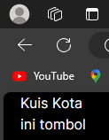
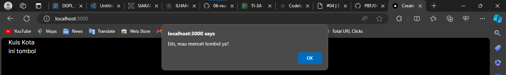
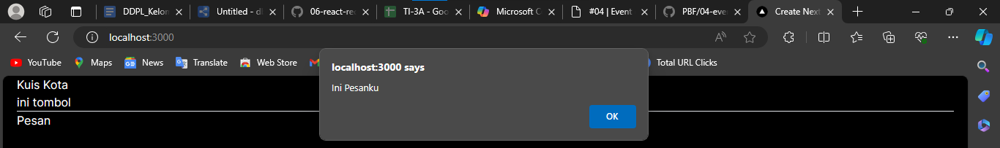
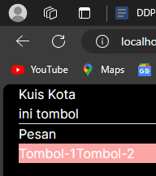
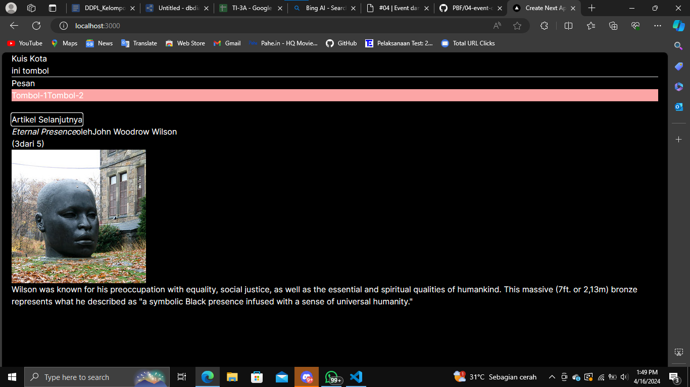
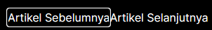
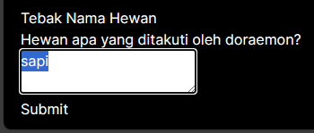
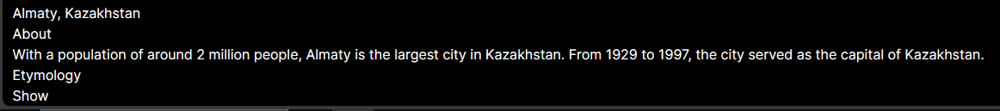
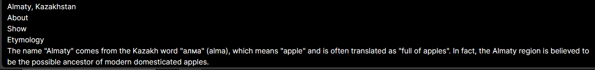

This is a [Next.js](https://nextjs.org/) project bootstrapped with [`create-next-app`](https://github.com/vercel/next.js/tree/canary/packages/create-next-app).

## Getting Started

First, run the development server:

```bash
npm run dev
# or
yarn dev
# or
pnpm dev
# or
bun dev
```

Open [http://localhost:3000](http://localhost:3000) with your browser to see the result.

You can start editing the page by modifying `app/page.tsx`. The page auto-updates as you edit the file.

This project uses [`next/font`](https://nextjs.org/docs/basic-features/font-optimization) to automatically optimize and load Inter, a custom Google Font.

## Learn More

To learn more about Next.js, take a look at the following resources:

- [Next.js Documentation](https://nextjs.org/docs) - learn about Next.js features and API.
- [Learn Next.js](https://nextjs.org/learn) - an interactive Next.js tutorial.

You can check out [the Next.js GitHub repository](https://github.com/vercel/next.js/) - your feedback and contributions are welcome!

## Deploy on Vercel

The easiest way to deploy your Next.js app is to use the [Vercel Platform](https://vercel.com/new?utm_medium=default-template&filter=next.js&utm_source=create-next-app&utm_campaign=create-next-app-readme) from the creators of Next.js.

Check out our [Next.js deployment documentation](https://nextjs.org/docs/deployment) for more details.

## Laporan Praktikum

|  | Pemrograman Berbasis Framework 2024 |
|--|--|
| NIM |  2141720230 |
| Nama |  Ilham Khalis Putra Agatha |
| Kelas | TI - 3A |

### Praktikum 1




### Praktikum 2



### Praktikum 3



### Praktikum 4



1. Jika kita menekan tombol "Artikel Selanjutnya" sebanyak 5x (atau melebihi halaman total artikel), apa yang akan terjadi?

Error

2. Modifikasilah gallery.tsx agar bisa meng-handle permasalahan tersebut.

```
function handleClick(){
    if (index >= sculptureList.length - 1) {
        setIndex(0);
    } else {
        setIndex(index + 1);
    }
}
```

3.  Tambahkan tombol "Artikel Sebelumnya", untuk menampilkan artikel secara mundur.



```
import {sculptureList} from '@/data/article';
import {useState} from 'react';

export default function Gallery(){
    const [index, setIndex] = useState(0);

    function handleNextClick(){
        if (index >= sculptureList.length - 1) {
            setIndex(0);
        } else {
            setIndex(index + 1);
        }
    }

    function handlePrevClick(){
        if (index <= 0) {
            setIndex(sculptureList.length - 1);
        } else {
            setIndex(index - 1);
        }
    }

    let sculpture = sculptureList[index];

    return(
        <>
        <button 
            onClick={handlePrevClick}
            className="bg-blue-500 hover:bg-blue-700 p-2 m-2 rounded"
        >
            Artikel Sebelumnya
        </button>
        <button 
            onClick={handleNextClick}
            className="bg-blue-500 hover:bg-blue-700 p-2 m-2 rounded"
        >
            Artikel Selanjutnya
        </button>
        <h2><i>{sculpture.name}</i> oleh {sculpture.artist}</h2>
        <h3>({index + 1} dari {sculptureList.length})</h3>
        
        <p>
            {sculpture.description}
        </p>
        </>
    );
}
```

### Praktikum 5



### Praktikum 6




1. Apa tujuan dari penulisan ini key={to.email} pada < Chat key={to.email} contact={to} / > ?

membantu mengidentifikasi item mana yang telah berubah, ditambahkan, atau dihapus.

2. Apa fungsi dari props key tersebut?

memastikan bahwa setiap anak dalam daftar memiliki identitas yang unik dan stabil